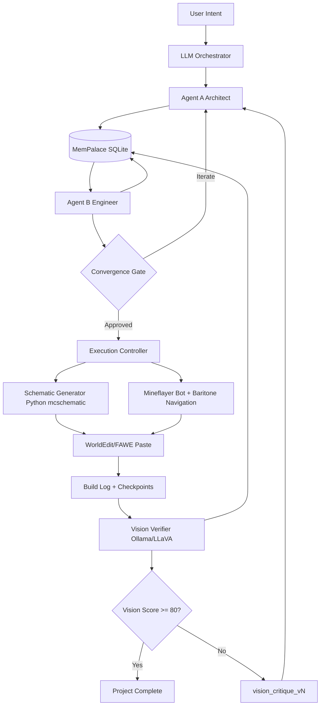

# Minecraft Dual Agent Autonomous Building Pipeline — Master Blueprint

**Document purpose:** This is the prescriptive, implementation-ready master plan for building a production-grade Minecraft autonomous building system using a Plan → Execute → Verify loop with dual LLM agents, deterministic execution services, and persistent hierarchical memory (MemPalace).

**System codename:** `minecraft_autonomous_builder`

---

### 1) Executive Summary

The system is a **dual-agent autonomous construction pipeline** for Minecraft that plans, validates, builds, and visually verifies complex structures (rockets, mansions, cities, planes, weapons with redstone functionality).

It addresses the two core failure modes of single-agent building systems:

1. **No true spatial memory/collision awareness** → fixed by `MemPalace` SQLite + `coord_index` collision layer.
2. **Context window collapse in large builds** → fixed by **sequential agent loading** (Agent A unloads before Agent B loads).

Core loop:
1. **Agent A (Architect)** generates/refines blueprint JSON + material manifest.
2. **Agent B (Engineer)** validates blueprint with structured checks, computes delta, sets approval.
3. **Convergence gate** decides iterate vs execute.
4. **Execution layer (no LLM)** converts approved modules to `.schem`, navigates/pastes in-world, checkpoints every batch.
5. **Vision verifier (LLaVA/Ollama)** scores build quality; low-score modules generate re-entry critiques into MemPalace.

This blueprint mandates:
- **Atomic writes** for all state transitions.
- **Crash-safe resume** using checkpoint JSON in `build_log`.
- **Version-aware block validation** (`mc_version`).
- **Deterministic acceptance criteria** for each phase.

---

### 2) System Architecture

#### 2.1 High-level interaction diagram



#### 2.2 Sequential VRAM architecture (non-negotiable)

- **Never run Agent A and Agent B simultaneously.**
- Orchestrator enforces:
  - Load A → complete A task → persist state → unload A
  - Load B → complete B task → persist critique → unload B
- All shared state is read/write via MemPalace accessor only.

#### 2.3 Plan-Execute-Verify lifecycle

1. `planning`: create initial blueprint versions.
2. `iterating`: refine via A/B critique loop.
3. `executing`: deterministic build services apply approved plan.
4. `verifying`: vision scoring and re-entry if needed.
5. `done`: all modules pass threshold and state finalized.

---

### 3) Technology Stack

#### 3.1 Core runtime

- **Python 3.11+**
  - orchestration, MemPalace accessor, schematic generation, verification pipeline glue
- **Node.js 20+**
  - mineflayer bot runtime, baritone navigation integration
- **SQLite 3.41+**
  - persistent memory, versioning, spatial index, checkpoints

#### 3.2 Python dependencies

- `pydantic>=2.7` (schema validation)
- `fastapi>=0.111` + `uvicorn>=0.30` (internal API service)
- `sqlalchemy>=2.0` or `sqlite3` stdlib (DB access; use one consistently)
- `alembic>=1.13` (migrations)
- `mcschematic>=11.4` (schematic generation)
- `numpy>=1.26` (geometry operations)
- `networkx>=3.3` (dependency graph/module ordering)
- `orjson>=3.10` (fast JSON)
- `httpx>=0.27` (internal service calls)
- `tenacity>=8.3` (retry policies)
- `pytest>=8.2`, `pytest-asyncio`, `pytest-cov`

#### 3.3 Node dependencies

- `mineflayer`
- `mineflayer-pathfinder`
- `mineflayer-baritone` (or equivalent baritone bridge)
- `vec3`
- `prismarine-world`, `prismarine-block` (state checks)
- `zod` (runtime validation)
- `pino` (structured logs)
- `vitest` or `jest`

#### 3.4 External tools/services

- **Minecraft Java server** (paper/purpur/spigot recommended)
- **WorldEdit / FAWE** plugin (schematic paste)
- **Ollama** local runtime
- **LLaVA model** for vision scoring
- Optional: `docker`, `docker-compose` for reproducible deployment

#### 3.5 Model routing strategy

- Agent A: creative/planning model (high reasoning, blueprint generation)
- Agent B: strict validation/critique model (structured, deterministic response style)
- Vision: LLaVA multimodal model through Ollama

---

### 4) Directory Structure

```text
minecraft_autonomous_builder/
├── AGENT.md
├── README.md
├── pyproject.toml
├── package.json
├── .env.example
├── docker-compose.yml
├── Makefile
├── configs/
│   ├── app.yaml
│   ├── model_routing.yaml
│   ├── minecraft_versions.yaml
│   ├── block_aliases_1_20.yaml
│   ├── redstone_components.yaml
│   └── project_builder_defaults/
│       ├── rocket.yaml
│       ├── mansion.yaml
│       ├── city.yaml
│       ├── plane.yaml
│       └── weapon.yaml
├── data/
│   ├── mempalace.db
│   ├── schematics/
│   ├── screenshots/
│   └── exports/
├── prompts/
│   ├── architect_system.md
│   ├── engineer_system.md
│   ├── vision_diff_prompt.md
│   └── scale_reference_table.md
├── schemas/
│   ├── project_intent.schema.json
│   ├── blueprint_module.schema.json
│   ├── critique.schema.json
│   ├── convergence_gate.schema.json
│   ├── material_manifest.schema.json
│   ├── checkpoint_state.schema.json
│   └── vision_diff.schema.json
├── src/
│   ├── common/
│   │   ├── logging.py
│   │   ├── errors.py
│   │   ├── constants.py
│   │   └── telemetry.py
│   ├── mempalace/
│   │   ├── accessor.py
│   │   ├── spatial_index.py
│   │   ├── repositories.py
│   │   └── migrations/
│   │       ├── 0001_init.sql
│   │       ├── 0002_coord_index.sql
│   │       └── 0003_build_log.sql
│   ├── orchestrator/
│   │   ├── service.py
│   │   ├── intent_parser.py
│   │   ├── convergence_gate.py
│   │   ├── phase_manager.py
│   │   └── model_runtime.py
│   ├── planning/
│   │   ├── architect_agent.py
│   │   ├── engineer_agent.py
│   │   ├── planner_io.py
│   │   └── validators.py
│   ├── schematics/
│   │   ├── generator.py
│   │   ├── module_templates.py
│   │   ├── redstone_lib.py
│   │   └── exporter.py
│   ├── execution/
│   │   ├── preflight.py
│   │   ├── batch_builder.py
│   │   ├── worldedit_adapter.py
│   │   └── build_resume.py
│   ├── vision/
│   │   ├── screenshotter.py
│   │   ├── llava_client.py
│   │   ├── scorer.py
│   │   └── critique_writer.py
│   ├── api/
│   │   ├── app.py
│   │   ├── routes_projects.py
│   │   ├── routes_builds.py
│   │   └── routes_health.py
│   └── project_builders/
│       ├── base_builder.py
│       ├── rocket_builder.py
│       ├── mansion_builder.py
│       ├── city_builder.py
│       ├── plane_builder.py
│       └── weapon_builder.py
├── bot/
│   ├── src/
│   │   ├── index.ts
│   │   ├── navigation.ts
│   │   ├── placement.ts
│   │   ├── world_state.ts
│   │   ├── inventory.ts
│   │   └── protocol.ts
│   └── tsconfig.json
├── tests/
│   ├── unit/
│   ├── integration/
│   └── e2e/
└── scripts/
    ├── init_db.py
    ├── seed_prompts.py
    ├── run_local_stack.sh
    ├── run_phase_smoke.sh
    └── export_blueprint.py
```

---

### 5) Component Specifications

#### 5.1 MemPalace (Memory Management)

**Responsibility:** authoritative persistent state for project lifecycle, blueprint versions, critiques, coordinates, checkpoints, and vision feedback.

**Hard requirements:**
- SQLite transaction boundaries for every mutating operation.
- Spatial collision checks before accepting module extents.
- `iteration_count` increments only via accessor.
- Agents cannot execute raw SQL.

##### 5.1.1 Tables (minimum)
- `projects`
- `blueprints`
- `critiques`
- `coord_index`
- `build_log`
- `vision_critiques`

##### 5.1.2 Accessor interface (Python)
- `create_project(project: ProjectCreate) -> ProjectRecord`
- `get_project(project_id: str) -> ProjectRecord`
- `insert_blueprint(blueprint: BlueprintWrite) -> BlueprintRecord`
- `reserve_coords(project_id: str, module: str, voxels: list[Coord]) -> ReservationResult`
- `detect_collision(voxels: list[Coord]) -> CollisionReport`
- `insert_critique(critique: CritiqueWrite) -> CritiqueRecord`
- `upsert_build_log(checkpoint: CheckpointWrite) -> BuildLogRecord`
- `insert_vision_critique(payload: VisionCritiqueWrite) -> VisionCritiqueRecord`
- `mark_vision_critique_resolved(critique_id: str) -> None`

##### 5.1.3 Spatial index rule
- `coord_index` composite primary key `(x, y, z)`.
- Reserve full module bounds before execution.
- On rollback: set status `rolled_back`; never hard delete historical claims.

#### 5.2 LLM Orchestrator (Planning & Intent Recognition)

**Responsibility:** parse user intent, route to project builder, run A/B loop, enforce convergence, hand off to execution.

**States:** `INIT`, `PLAN_A`, `VALIDATE_B`, `GATE`, `EXECUTE`, `VISION_VERIFY`, `REENTER`, `DONE`, `FAILED`.

**Convergence policy (exact):**
- Approve if `delta_score < 5`
- Approve if `approval_flag == true`
- Force stop iterate if `iteration_count >= 3` and choose best `quality_score`

**Intent extraction outputs:**
- project_type, dimensions, style tags, redstone requirements, allowed materials, server version, budget constraints.

#### 5.3 Schematic Generator (Python + mcschematic)

**Responsibility:** transform approved `block_data` JSON modules into `.schem` artifacts.

**Rules:**
- deterministic sort order: `y`, then `x`, then `z`
- all blocks validated against `mc_version`
- redstone modules generated from `redstone_lib.py` templates
- write one schematic per module + one merged project schematic

**Outputs:**
- `data/schematics/{project_id}/{module_name}_v{version}.schem`
- placement manifest JSON for execution layer

#### 5.4 Mineflayer Bot (Node.js + Baritone)

**Responsibility:** movement, world interaction, chunk readiness checks, inventory checks, invoking paste commands where needed.

**Critical separation:**
- **Baritone/mineflayer pathfinding = navigation only**
- **WorldEdit/FAWE = paste only**

**Required capabilities:**
- move to paste origin safely
- wait for chunk loaded and stable TPS
- verify required inventory before operation
- retry transient command failures
- send checkpoint event after each batch

#### 5.5 Vision Verifier (Ollama + LLaVA)

**Responsibility:** evaluate screenshots against expected module specs and produce structured numeric score.

**Prompt contract:**
- expected block counts per module
- symmetry expectation axis
- required redstone functional cues
- output only strict JSON with quality `0..100`

**Thresholds:**
- `>=80`: phase pass
- `<80`: write `vision_critique_vN`, mark flagged modules, trigger re-entry

#### 5.6 Project Builders (rocket, mansion, city, plane, weapon)

Each builder extends `BaseProjectBuilder` and must implement:
- `normalize_intent()`
- `emit_required_modules()`
- `emit_redstone_requirements()`
- `emit_validation_invariants()`

##### 5.6.1 Rocket builder
- Modules: launch pad, fuel tanks, body stages, nose cone, boosters, command bay
- Redstone: ignition sequence, countdown lights, optional piston animation

##### 5.6.2 Mansion builder
- Modules: foundation grid, room graph, stair cores, facade, roof, interiors
- Redstone: hidden doors, lighting circuits, trap/defense options

##### 5.6.3 City builder
- Modules: road network, zoning blocks, utilities, towers, public spaces
- Redstone: traffic signals, rail dispatch, timed lighting districts

##### 5.6.4 Plane builder
- Modules: fuselage, wings, tail assembly, landing gear, cockpit
- Redstone: beacon lights, retract simulation, cockpit instrumentation

##### 5.6.5 Weapon builder
- Modules: shell, mechanism chamber, trigger logic, ammo handling, safety enclosure
- Redstone: TNT-safe gating, lockout states, cooldown circuit
- Must include safety rules preventing accidental chain detonation in testing worlds.

---

### 6) Data Formats (JSON Schemas)

> Canonical schemas are stored in `/schemas/*.schema.json`. Below are required fields and constraints.

#### 6.1 `project_intent.schema.json`

```json
{
  "$id": "project_intent.schema.json",
  "type": "object",
  "required": ["project_id", "project_type", "mc_version", "origin_xyz", "requirements"],
  "properties": {
    "project_id": {"type": "string"},
    "project_type": {"enum": ["rocket", "mansion", "city", "plane", "weapon"]},
    "mc_version": {"type": "string"},
    "origin_xyz": {
      "type": "object",
      "required": ["x", "y", "z"],
      "properties": {"x": {"type": "integer"}, "y": {"type": "integer"}, "z": {"type": "integer"}}
    },
    "requirements": {
      "type": "object",
      "properties": {
        "size": {"type": "string"},
        "style": {"type": "array", "items": {"type": "string"}},
        "redstone_features": {"type": "array", "items": {"type": "string"}},
        "max_iterations": {"type": "integer", "minimum": 1, "maximum": 10}
      }
    }
  }
}
```

#### 6.2 `blueprint_module.schema.json`

```json
{
  "type": "object",
  "required": ["blueprint_id", "project_id", "version", "module_name", "block_data", "material_manifest"],
  "properties": {
    "blueprint_id": {"type": "string"},
    "project_id": {"type": "string"},
    "version": {"type": "integer", "minimum": 1},
    "module_name": {"type": "string"},
    "bounds": {
      "type": "object",
      "required": ["min", "max"],
      "properties": {
        "min": {"type": "object", "properties": {"x": {"type": "integer"}, "y": {"type": "integer"}, "z": {"type": "integer"}}},
        "max": {"type": "object", "properties": {"x": {"type": "integer"}, "y": {"type": "integer"}, "z": {"type": "integer"}}}
      }
    },
    "block_data": {
      "type": "array",
      "items": {
        "type": "object",
        "required": ["x", "y", "z", "block_id"],
        "properties": {
          "x": {"type": "integer"},
          "y": {"type": "integer"},
          "z": {"type": "integer"},
          "block_id": {"type": "string"},
          "state": {"type": "object"}
        }
      }
    },
    "material_manifest": {
      "type": "object",
      "additionalProperties": {"type": "integer", "minimum": 1}
    },
    "quality_score": {"type": "number", "minimum": 0, "maximum": 100}
  }
}
```

#### 6.3 `critique.schema.json`

```json
{
  "type": "object",
  "required": ["critique_id", "blueprint_id", "iteration", "delta_score", "issues", "approval_flag"],
  "properties": {
    "critique_id": {"type": "string"},
    "blueprint_id": {"type": "string"},
    "iteration": {"type": "integer", "minimum": 1},
    "delta_score": {"type": "number", "minimum": 0, "maximum": 100},
    "issues": {
      "type": "array",
      "items": {
        "type": "object",
        "required": ["issue_code", "priority", "message", "module_name"],
        "properties": {
          "issue_code": {"type": "string"},
          "priority": {"enum": ["P0", "P1", "P2", "P3"]},
          "message": {"type": "string"},
          "module_name": {"type": "string"},
          "suggested_fix": {"type": "string"}
        }
      }
    },
    "approval_flag": {"type": "boolean"}
  }
}
```

#### 6.4 `checkpoint_state.schema.json`

```json
{
  "type": "object",
  "required": ["blueprint_id", "batch_index", "completed_batches", "current_origin", "inventory_snapshot"],
  "properties": {
    "blueprint_id": {"type": "string"},
    "batch_index": {"type": "integer", "minimum": 0},
    "completed_batches": {"type": "array", "items": {"type": "integer"}},
    "current_origin": {"type": "object", "properties": {"x": {"type": "integer"}, "y": {"type": "integer"}, "z": {"type": "integer"}}},
    "inventory_snapshot": {"type": "object", "additionalProperties": {"type": "integer", "minimum": 0}},
    "retry_count": {"type": "integer", "minimum": 0},
    "last_error": {"type": ["string", "null"]}
  }
}
```

#### 6.5 `vision_diff.schema.json`

```json
{
  "type": "object",
  "required": ["vision_score", "flagged_modules", "diff_detail"],
  "properties": {
    "vision_score": {"type": "number", "minimum": 0, "maximum": 100},
    "flagged_modules": {"type": "array", "items": {"type": "string"}},
    "diff_detail": {
      "type": "array",
      "items": {
        "type": "object",
        "required": ["module_name", "expected_blocks", "observed_blocks", "symmetry_score"],
        "properties": {
          "module_name": {"type": "string"},
          "expected_blocks": {"type": "integer", "minimum": 0},
          "observed_blocks": {"type": "integer", "minimum": 0},
          "symmetry_score": {"type": "number", "minimum": 0, "maximum": 100}
        }
      }
    }
  }
}
```

---

### 7) API Contracts (Internal)

#### 7.1 Orchestrator API (FastAPI)

- `POST /projects`
  - input: `project_intent`
  - output: `project_id`, initial status
- `POST /projects/{project_id}/plan`
  - triggers A/B loop until gate resolution
- `POST /projects/{project_id}/execute`
  - runs preflight + batch build + checkpoints
- `POST /projects/{project_id}/verify`
  - runs vision scoring pass
- `POST /projects/{project_id}/resume`
  - resumes from latest `build_log.checkpoint_state`
- `GET /projects/{project_id}/state`
  - full state snapshot for UI/CLI

#### 7.2 Agent contract

##### Architect input
```json
{
  "project": {},
  "latest_blueprint": {},
  "open_critiques": [],
  "vision_critiques": [],
  "scale_reference": {},
  "mc_version_rules": {}
}
```

##### Architect output
```json
{
  "blueprint_modules": [],
  "material_manifest": {},
  "coord_proposals": [],
  "change_summary": "string"
}
```

##### Engineer input
```json
{
  "project": {},
  "blueprint_modules": [],
  "material_manifest": {},
  "coord_index_snapshot": {}
}
```

##### Engineer output
```json
{
  "delta_score": 0,
  "issues": [],
  "approval_flag": false,
  "quality_score": 0
}
```

#### 7.3 Execution contract

- Input: approved blueprint version + module placement order + inventory manifest.
- Output per batch:
  - `batch_index`
  - `blocks_placed`
  - `checkpoint_state`
  - `status` (`ok|retry|failed`)

#### 7.4 Vision contract

- Input: screenshot paths + expected module specs.
- Output: strict `vision_diff` JSON.

---

### 8) Implementation Phases (8 Detailed Phases)

#### Phase 1 — Foundation & Repository Bootstrap

**Goal:** establish reproducible project skeleton, dependency management, and coding standards.

**Files to create:**
- `README.md`, `pyproject.toml`, `package.json`, `.env.example`, `Makefile`
- directory tree from Section 4

**Tasks:**
1. Initialize Python and Node package managers.
2. Add lint/format (`ruff`, `black`, `prettier`, `eslint`).
3. Add CI workflow for tests/lint.
4. Add baseline logging and error modules.

**Acceptance criteria:**
- `make setup` installs both Python and Node deps.
- `make lint` and `make test` run successfully on blank scaffold.

#### Phase 2 — MemPalace Core + Migrations

**Goal:** implement persistent memory backend with collision-safe coordinate reservations.

**Files:**
- `src/mempalace/accessor.py`
- `src/mempalace/spatial_index.py`
- SQL migrations under `src/mempalace/migrations/`
- `scripts/init_db.py`

**Tasks:**
1. Create all six core tables.
2. Add transaction-safe insert/update methods.
3. Implement collision detection query for bounding boxes/voxel lists.
4. Implement stale reservation handling (`reserved_at` age checks).

**Acceptance criteria:**
- Unit tests prove collision detection works for overlapping/non-overlapping modules.
- Crash simulation confirms no partial reservation writes.

#### Phase 3 — Intent Parsing + Project Builders

**Goal:** map user prompts into normalized project specs and builder-specific module plans.

**Files:**
- `src/orchestrator/intent_parser.py`
- `src/project_builders/base_builder.py`
- five builder modules
- default YAMLs under `configs/project_builder_defaults/`

**Tasks:**
1. Implement intent schema validation.
2. Build builder factory by `project_type`.
3. Encode redstone requirements per type.
4. Emit deterministic initial module graph and invariants.

**Acceptance criteria:**
- For each project type, parser returns valid normalized plan.
- Builder outputs satisfy JSON schema and include redstone requirement list.

#### Phase 4 — Dual-Agent Planning Loop (A/B + Gate)

**Goal:** productionize the architect-engineer iterative planning pipeline.

**Files:**
- `src/planning/architect_agent.py`
- `src/planning/engineer_agent.py`
- `src/orchestrator/convergence_gate.py`
- prompt files in `/prompts`

**Tasks:**
1. Implement Agent A input assembly from MemPalace state.
2. Validate Agent A output schema and persist versioned blueprint.
3. Implement Agent B structured validation checks.
4. Persist critique and evaluate convergence policy.
5. Enforce sequential load/unload semantics.

**Acceptance criteria:**
- Loop stops by one of three convergence rules.
- Version history persisted and retrievable.
- No direct SQL usage from agents.

#### Phase 5 — Schematic Generation + Version Compatibility

**Goal:** convert approved JSON blueprints to Minecraft schematic artifacts with version-safe blocks.

**Files:**
- `src/schematics/generator.py`
- `src/schematics/exporter.py`
- `configs/minecraft_versions.yaml`
- `configs/block_aliases_1_20.yaml`

**Tasks:**
1. Implement block ID compatibility validator by `mc_version`.
2. Convert each module to `.schem` with deterministic ordering.
3. Generate merged schematic and placement manifest.
4. Add material count reconciliation checks.

**Acceptance criteria:**
- Every approved module emits valid `.schem` file.
- Incompatible block IDs are rejected before execution.

#### Phase 6 — Execution Layer (Preflight + Batch + Resume)

**Goal:** deterministic world execution with recovery.

**Files:**
- `src/execution/preflight.py`
- `src/execution/batch_builder.py`
- `src/execution/build_resume.py`
- `bot/src/*`

**Tasks:**
1. Terrain scan and flatten routine.
2. Chunk loading and inventory diff checks.
3. Mineflayer navigation to paste points.
4. WorldEdit/FAWE paste command dispatch.
5. Write `checkpoint_state` to `build_log` after each batch.
6. Implement resume from latest successful checkpoint.

**Acceptance criteria:**
- Interrupted build can resume with no duplicate placed batches.
- Preflight fails fast on inventory/terrain blockers.

#### Phase 7 — Vision Verification + Re-entry Loop

**Goal:** enforce objective post-build quality scoring and targeted correction.

**Files:**
- `src/vision/llava_client.py`
- `src/vision/scorer.py`
- `src/vision/critique_writer.py`
- `prompts/vision_diff_prompt.md`

**Tasks:**
1. Capture deterministic screenshots per module/phase.
2. Send structured prompts to LLaVA via Ollama.
3. Parse strict JSON result into `vision_critiques`.
4. Trigger targeted re-entry into Agent A for flagged modules only.

**Acceptance criteria:**
- Scores below 80 create `vision_critique_vN` and restart planning for affected modules only.
- Scores >= 80 mark module phase complete.

#### Phase 8 — Hardening, Observability, Packaging, and Release

**Goal:** production readiness and operator visibility.

**Files:**
- `src/common/telemetry.py`
- `src/api/*`
- `docker-compose.yml`
- `scripts/run_local_stack.sh`

**Tasks:**
1. Add structured logs and trace IDs across Python/Node.
2. Add health/readiness endpoints.
3. Add dashboards/metrics export hooks.
4. Build dockerized stack for reproducible startup.
5. Write runbooks for failure scenarios.

**Acceptance criteria:**
- One-command local bring-up succeeds.
- E2E test suite passes for at least one project per type.
- Runbook validates crash/restart recovery.

---

### 9) Configuration

#### 9.1 Environment variables

```bash
# Core
APP_ENV=development
LOG_LEVEL=INFO
DATA_DIR=./data

# MemPalace
MEMPALACE_DB_PATH=./data/mempalace.db
MEMPALACE_BUSY_TIMEOUT_MS=5000
RESERVATION_STALE_MINUTES=30

# LLM orchestration
ARCHITECT_MODEL=your-architect-model
ENGINEER_MODEL=your-engineer-model
MAX_ITERATIONS=3
DELTA_APPROVAL_THRESHOLD=5

# Minecraft
MC_HOST=127.0.0.1
MC_PORT=25565
MC_USERNAME=builder_bot
MC_VERSION=1.20.4
WE_COMMAND_PREFIX=//

# Execution
BUILD_BATCH_SIZE=500
PRECHECK_RADIUS=128
INVENTORY_STRICT=true

# Vision
OLLAMA_BASE_URL=http://127.0.0.1:11434
OLLAMA_MODEL=llava:latest
VISION_PASS_THRESHOLD=80
SCREENSHOT_DIR=./data/screenshots

# API
API_HOST=0.0.0.0
API_PORT=8080
```

#### 9.2 Static config files

- `configs/model_routing.yaml`: mapping of task → model
- `configs/minecraft_versions.yaml`: allowed block namespace/version mapping
- `configs/redstone_components.yaml`: reusable redstone templates and invariants
- `configs/app.yaml`: runtime feature flags

---

### 10) Testing Strategy

#### 10.1 Unit tests

Focus areas:
- MemPalace transaction safety and collision logic
- Schema validation for all payloads
- Convergence gate decisions
- Block compatibility resolver
- Builder module graph generation

#### 10.2 Integration tests

- A/B planning loop with mocked model outputs
- Schematic generation from approved blueprint
- Bot protocol adapters with simulated server responses
- Vision scoring parser with mocked Ollama JSON

#### 10.3 End-to-end tests

For each project type (`rocket`, `mansion`, `city`, `plane`, `weapon`):
1. Submit intent
2. Plan approval achieved
3. Execute in test world
4. Verify vision score >= threshold
5. Assert project status `done`

#### 10.4 Failure injection tests

- DB lock timeout and retry
- Mid-batch process crash and resume
- Invalid block IDs for target version
- Vision low score re-entry path

#### 10.5 Quality gates

- `pytest --cov` >= 85%
- no schema validation bypasses
- all critical paths produce structured logs

---

### 11) Deployment Guide

#### 11.1 Local development

1. Install Python 3.11+, Node 20+, Java (for Minecraft server).
2. Start Minecraft server with WorldEdit/FAWE installed.
3. Run Ollama and pull LLaVA model.
4. Copy `.env.example` → `.env` and configure values.
5. Run DB migrations.
6. Start API + bot workers.
7. Trigger project workflow via API/CLI.

#### 11.2 Dockerized stack

Services:
- `api` (FastAPI)
- `bot` (Node mineflayer worker)
- `ollama` (if running locally in compose)
- `db` (SQLite volume mount)

Deploy command:
- `docker compose up --build`

#### 11.3 Operational run sequence

1. `POST /projects`
2. `POST /projects/{id}/plan`
3. `POST /projects/{id}/execute`
4. `POST /projects/{id}/verify`
5. If verify fails, orchestrator auto re-enters planning for flagged modules.

#### 11.4 Recovery

- Use `POST /projects/{id}/resume` to restore from latest `checkpoint_state`.
- If reservation staleness detected, run maintenance task to release stale locks safely.

---

### 12) Extension Points (Adding New Project Types)

To add a new project type (example: `bridge`):

1. Add enum value in `project_intent.schema.json`.
2. Create `src/project_builders/bridge_builder.py` extending `BaseProjectBuilder`.
3. Add defaults file `configs/project_builder_defaults/bridge.yaml`.
4. Register builder in factory map.
5. Add redstone templates if needed in `configs/redstone_components.yaml`.
6. Add test sets:
   - unit: builder invariants
   - integration: planning loop compatibility
   - e2e: build + vision pass in test world
7. Update prompts with builder-specific planning constraints.
8. Document operational profile in README.

**Compatibility requirement:** new builders must still emit canonical `blueprint_module` + `material_manifest` payloads.

---

### 13) Non-Functional Requirements (Mandatory)

- Determinism: repeatable module generation given same seeds/constraints.
- Durability: no state loss across orchestrator restarts.
- Auditability: every decision linked to blueprint/critique/version IDs.
- Safety: weapon/redstone modules run only in approved test worlds unless explicitly overridden.
- Performance: planner loop under configured timeout, checkpoint every batch.

---

### 14) Build Order Checklist (Operator Quick Reference)

1. Initialize project + MemPalace tables.
2. Ingest user intent and normalize via project builder.
3. Run A/B planning loop to convergence.
4. Lock coordinates and validate preflight.
5. Generate schematics and execute by batch.
6. Write checkpoints continuously.
7. Run vision verification.
8. Re-enter targeted refinement if score below threshold.
9. Mark project done and export artifacts.

---

### 15) Definition of Done

A project is considered complete only if all are true:
- Convergence gate approved a blueprint.
- All batches executed or resumed successfully with zero unresolved failures.
- Vision verification score >= threshold for all required modules.
- `projects.status = done`.
- Final blueprint, critique history, and build logs are archived/exportable.

This document is the canonical implementation contract for the Minecraft Dual Agent autonomous building pipeline.