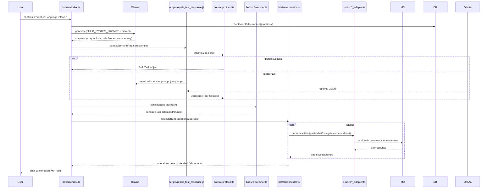

# Minecraft Autonomous Builder

Implementation of the AGENT.md blueprint: a dual-agent Plan → Execute → Verify pipeline with persistent MemPalace state, schematic generation, execution checkpoints, and vision verification. This README section gives an expert-level architecture overview, component responsibilities, diagrams (Mermaid), data-model details, failure modes, and operational notes.

## Quick start

```bash
cp .env.example .env
make setup
make init-db
make test
make run-api
```

## API flow
1. `POST /projects`
2. `POST /projects/{project_id}/plan`
3. `POST /projects/{project_id}/execute`
4. `POST /projects/{project_id}/verify`
5. `POST /projects/{project_id}/resume` (if needed)

## Architecture Overview (for expert review)

The runtime is split between a Node.js TypeScript bot (live chat-driven) and a small set of ESM Node scripts used for LLM testing, repair and validation. The live bot uses Mineflayer adapters to interact with a running Minecraft server (with WorldEdit). An Ollama LLM backend generates BuildTask JSON which is then repaired, validated (zod), sanitized, and executed by a robust executor.

### High-level system diagram

```mermaid
flowchart LR
	U[User Chat Client]
	BotIndex[bot/src/index.ts<br/>Chat handler & CLI entry]
	Gen[LLM Generator<br/>generateBuildTaskFromPrompt()]
	Ollama[(Ollama HTTP API)]
	Repair[LLM Repair & Extraction<br/>scripts/repair_test_response.js]
	Validator[Zod Schemas<br/>bot/src/protocol.ts]
	Sanitizer[Sanitization Layer<br/>bot/src/executor.ts:sanitizeBuildTask()]
	Executor[Executor<br/>bot/src/executor.ts:executeBuildTask()]
	Adapters[Adapters<br/>bot/src/navigation.ts<br/>bot/src/placement.ts<br/>bot/src/inventory.ts<br/>bot/src/world_state.ts]
	MC[Minecraft Server + WorldEdit]
	DB[data/mempalace.db (sqlite)]
	Config[bot/config.json & env]
	Logger[Pino Logger]
	Scripts[bot/scripts/*]

	U -->|!bot build <natural prompt>| BotIndex
	BotIndex -->|BUILD_SYSTEM_PROMPT + user prompt| Gen
	Gen -->|HTTP /api/generate| Ollama
	Ollama -->|noisy text response| Repair
	Repair -->|extracted JSON| Validator
	Validator -->|BuildTask object| Sanitizer
	Sanitizer --> Executor
	Executor --> Adapters
	Adapters -->|WorldEdit commands, movements| MC
	Executor --> Logger
	BotIndex --> DB
	BotIndex --> Config
	BotIndex --> Scripts

	subgraph "Optional: offline/tooling"
		Scripts --> Repair
		Scripts --> Validator
		Scripts --> Executor
	end
```

### Primary runtime sequence (chat-driven `!bot build`)



## Component Responsibilities (files & behavior)

- `bot/src/index.ts`: chat command handler, life-cycle (start/reconnect), command parsing, permission checks, model selection persistence (`bot/config.json`), triggers the generate→repair→validate→sanitize→execute pipeline. See [bot/src/index.ts](bot/src/index.ts).
- `bot/src/protocol.ts`: zod schemas for `BuildTask` and `BuildStep` (discriminated union on `action`). Canonical validator used across scripts and runtime. See [bot/src/protocol.ts](bot/src/protocol.ts).
- `bot/src/executor.ts`: shared executor and sanitizer. Exposes `sanitizeBuildTask(task, logger)` and `executeBuildTask(bot, task, ctx)` with step-level retries, timeouts, and logging. See [bot/src/executor.ts](bot/src/executor.ts).
- Adapters:
	- `bot/src/navigation.ts`: pathfinding via mineflayer-pathfinder (goto, follow, check arrival).
	- `bot/src/placement.ts`: wrapper around WorldEdit / paste operations, `pasteWithRetry`, applying RateLimit/backoff.
	- `bot/src/inventory.ts`: equip/collect/ensure items.
	- `bot/src/world_state.ts`: read-only view of the world (blocks, players, entities).
	See files in [bot/src/](bot/src/).
- `bot/scripts/`:
	- `test_llm.js`: sends prompt to Ollama and saves raw output to `bot/test_llm_response.txt`.
	- `repair_test_response.js`: extracts inner JSON, applies syntactic repairs, writes `bot/test_llm_repaired.json`.
	- `validate_repaired.js`: validates repaired JSON with zod and logs results.
	- `execute_repaired_build.js`: test-run harness that sanitizes and executes a repaired build file against a live server.

## BuildTask (data model) — detailed schema overview

The bot expects a validated BuildTask object. Key shape (summary):

- `intent: string` — high level intent, e.g. "build".
- `schematic?: string` — optional schematic identifier.
- `target?: { relative?: string; distance?: number; x?: number; y?: number; z?: number }` — where to place relative/absolute.
- `steps: BuildStep[]` — ordered array; each step is a discriminated union by `action`:
	- `paste`: `{ action: 'paste', command: string }` — WorldEdit paste invocation.
	- `place`: `{ action: 'place', blockType: string, position?: {x,y,z} }` — single-block placements.
	- `chat`: `{ action: 'chat', message: string }` — send chat to players/confirmation.
	- `wait`: `{ action: 'wait', duration_ms: number }` — pause between steps.
	- `command`: `{ action: 'command', command: string }` — in-game command; strictly sanitized/whitelisted.
	- `navigate`: `{ action: 'navigate', destination: {x,y,z}|{relative,distance} }` — move bot
	- `inventory`: `{ action: 'collect'|'equip', item: string, count?: number }` — ensure items.

Validation constraints applied by `zod`:
- Required keys: `intent`, `steps` (non-empty array).
- `steps` actions must be one of the supported discriminants.
- String lengths, numeric ranges, and command patterns are clamped/validated where applicable.

For the exact canonical schema, see [bot/src/protocol.ts](bot/src/protocol.ts).

## LLM interaction, repair and deterministic fallbacks

- Primary LLM endpoint: Ollama (`OLLAMA_URL` + `/api/generate`).
- Generation call uses an enforced `BUILD_SYSTEM_PROMPT` to request strict JSON-only output. The prompt chain is:
	1. system: `BUILD_SYSTEM_PROMPT` (server-level env override)
	2. user: raw user prompt
- Repair heuristics (applied in `generateBuildTaskFromPrompt` and `scripts/repair_test_response.js`):
	- Remove code fences and surrounding commentary.
	- Normalize quotes (smart → ASCII), replace single quotes with double where safe.
	- Remove trailing commas and dangling commas in arrays/objects.
	- Try incremental parse attempts with increasing tolerance (strip non-json prefix/suffix, find top-level `{`..`}` block, balance braces).
	- If parsing fails after N retries, ask the model again with a stricter instruction (replay with system prompt requiring only JSON).
	- If still failing, use a deterministic fallback BuildTask (the "chicken" fallback used for development/testing).

Retry policy: configurable retries (default 2-3) with exponential backoff. All retries are logged.

## Sanitization layer (defense-in-depth before executing any in-game side-effect)

Sanitizer responsibilities (implemented in `sanitizeBuildTask`):

- Allowed action whitelist: `paste`, `place`, `chat`, `wait`, `command` (command is heavily restricted), `navigate`, `inventory`.
- Command whitelisting: only allow a small set of WorldEdit and server-safe patterns. Examples allowed: `^//schematic load\s+\w+`, `^//paste$`, `^//set\s+.*` (as configured). Anything matching server admin patterns (e.g., `op`, `deop`, `stop`, `restart`, `rm -rf`, `save-all`, `reload`, `whitelist`) is explicitly blocked.
- Remove or split multi-line commands into safe units; strip shell-like separators (`;`, `&&`, `|`).
- Clamp numeric values: `duration_ms` capped (e.g., max 120000 ms), `distance` capped (e.g., max 50 blocks), `paste` size heuristics applied.
- Trim long messages to a safe maximum length and disallow special control sequences.
- Annotate sanitized diffs: the sanitizer returns a short `sanitization_log` describing changes.

The sanitizer acts as a last line of defense even if the LLM asserts innocuous intent.

## Executor semantics and robustness

- Step ordering: executor preserves step order as provided but the runtime can optionally enforce ordering rules (e.g., `paste` / `place` steps should precede confirmation `chat` steps). This repository currently keeps LLM order but includes a recommended configuration to auto-move `paste` before `chat` if the resulting sequence is unsafe.
- Per-step guarantees:
	- `paste` and `command` steps use retries with idempotency checks and timeouts.
	- `navigate` uses pathfinder arrival checks and move retries.
	- `wait` is honored with precise timers and interruptible on fatal failures.
- Failure handling: configurable policy — `abort_on_step_failure` (default true) vs `continue_on_error`.
- Context & replay: each executed step is logged with timestamps and results; replay harness can re-run a sanitized `BuildTask` from the logs.

## Configuration & environment

Key environment variables and runtime config locations:

- `OLLAMA_URL` — base URL for the Ollama HTTP server.
- `OLLAMA_MODEL` — default model to ask (persisted per-server in `bot/config.json`).
- `MODEL_PING_TIMEOUT_MS`, `MODEL_HEALTH_INTERVAL_MS` — model-health polling.
- `MEMPALACE_DB_PATH` — path to `data/mempalace.db` (sqlite).
- `MC_HOST`, `MC_PORT`, `MC_USER` — Minecraft connection settings.
- `BUILD_SYSTEM_PROMPT` — override system prompt to enforce JSON-only responses.

Example persistent config: `bot/config.json` (structure used by `bot/src/index.ts`). See [bot/config.example.json](bot/config.example.json).

## Scripts, artifacts and developer tooling

- `npm run llm:all` — runs the test/repair/validate chain: `test_llm.js` → `repair_test_response.js` → `validate_repaired.js`. Produces:
	- `bot/test_llm_response.txt` — raw LLM text
	- `bot/test_llm_repaired.json` — repaired JSON
	- `bot/llm_run.log` — run log
- `node scripts/execute_repaired_build.js` — runs a sanitized test build against a live server (test harness using the executor).

Use these scripts for iterative model prompt engineering and to reproduce failures locally.

## Failures, attack surface and mitigations (expert review)

- LLM malformations: solved via multi-stage repair + zod validation + deterministic fallback.
- Command injection: prevented by strict command whitelists, separator stripping, and the sanitizer.
- Privilege escalation: bot runs without server operator privileges by design; any operation requiring operator status must be gated and manually approved.
- Model availability failures: detected via `pingModel()` and periodic health checks; model selection persisted in `bot/config.json`. Auto-pull of missing models is a planned improvement (requires `ollama` CLI access).
- Data consistency: all executed steps are logged to allow replay and audit; partial failures abort by default to avoid half-built schematics.

## Recommended next improvements

1. Add server-level admin whitelist in `bot/config.json` and enforce in `bot/src/index.ts` before generation. (high priority)
2. Implement `--dry-run` preview mode to return the sanitized task without executing. (medium priority)
3. Auto-pull/auto-install missing Ollama models with a safe timeout and admin confirmation. (optional)
4. Expand deterministic fallback library (more sample builds) for resilience in offline testing.

## Where to look in the code

- Entry point & chat flow: [bot/src/index.ts](bot/src/index.ts)
- Protocol / validation: [bot/src/protocol.ts](bot/src/protocol.ts)
- Sanitizer & executor: [bot/src/executor.ts](bot/src/executor.ts)
- Adapters: [bot/src/navigation.ts](bot/src/navigation.ts), [bot/src/placement.ts](bot/src/placement.ts), [bot/src/inventory.ts](bot/src/inventory.ts), [bot/src/world_state.ts](bot/src/world_state.ts)
- LLM tooling scripts: [bot/scripts/test_llm.js](bot/scripts/test_llm.js), [bot/scripts/repair_test_response.js](bot/scripts/repair_test_response.js), [bot/scripts/validate_repaired.js](bot/scripts/validate_repaired.js), [bot/scripts/execute_repaired_build.js](bot/scripts/execute_repaired_build.js)

---
This README section is intended to give reviewers the necessary context to audit safety, correctness, and operational readiness of the `!bot build` pipeline. If you want, I can also:
- add an appendix with the exact `zod` schema source from `bot/src/protocol.ts` excerpted verbatim,
- add a machine-readable JSON Schema for CI validation,
- or generate a Graphviz/PDF export of the diagrams for inclusion in architecture docs.

Last update: detailed architecture and diagrams added for expert review. See [bot/README.md](bot/README.md) for bot-specific docs.
